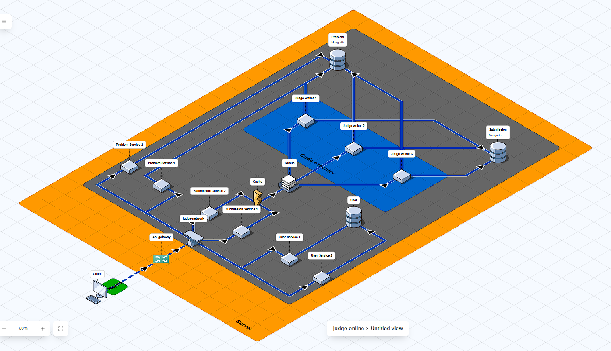

# Week 2  
## Vương Đức Trọng - B22DCCN866

## [Online Judge]

## MÔ TẢ HỆ THỐNG

> Hệ thống **Microservice** bao gồm **server** xử lý yêu cầu và **client** gửi yêu cầu đến server qua giao thức HTTP REST API + RabbitMQ (message queue).**Server** cung cấp API cho phép login logout, xem đề và nộp bài, xem bảng xếp hạng. **Client** là frontend - web để hiển thị giao diện tương tác với **Server**



- Click https://www.icewolfsoft.com/fossflow/
<!-- - Then upload file [Judge-Online Structure](structure/judge-online-2025-11-01.json) -->

## CÔNG NGHỆ SỬ DỤNG

### 1. Kiến trúc tổng thể
| Thành phần | Công nghệ | Ghi chú |
|------------|-----------|---------|
| Structure | Microservices | Architecture|
| Server | Node.js 18 + Axios,  | REST API |
| Client | ReactJS + TailwindCSS/antd | Giao tiếp HTTP |
| Deploy | Docker & Docker Compose | Build Service |
| Store Cache & Queue|Redis, RabbitMQ|Cache và hàng đợi|
| Database | MongoDB (3 instance tách biệt users, problems, submissions) | Lưu trữ dữ liệu |
| proxy / load balancer|nginx|N/A|


### 3. Các Microservices chính

| Service | Công nghệ chính |Framework / Thư viện chính|Chức năng|
|-------- |-----------------|--------------------------|---------|
|API Gateway|Node.js (v18+)|express, axios, ioredis, express-rate-limit, cors|Định tuyến request, rate limiting, kết nối frontend <=> backend|
|User Service|Node.js (v18+)|express, bcryptjs, jsonwebtoken, mongodb, ioredis, dotenv|Quản lý người dùng, xác thực JWT|
|Problem Service|Node.js (v18+)|express, mongodb, ioredis|Quản lý bài tập, dữ liệu bài toán|
|Submission Service|Node.js (v18+)|express, amqplib, mongodb, axios, ioredis|Quản lý bài nộp, tương tác với Judge Worker qua RabbitMQ|
|Judge Worker|Java 21+| springboot, amqplib, ioredis|N/A|

### 5. Bài toán giải quyết
#### 5.1. Load Shedding (Giảm tải động)
> Là kỹ thuật giảm tải có kiểm soát khi hệ thống bị quá tải tài nguyên (CPU, memory, queue đầy, I/O chậm)

> Thay vì để toàn hệ thống sập, một phần yêu cầu sẽ bị từ chối (reject) sớm để bảo vệ hệ thống chính

**Hệ thống theo dõi CPU usage, queue length, request latency. Khi vượt ngưỡng (ví dụ CPU > 85% hoặc queue backlog quá lớn):Ngừng chấp nhận một số request.Trả về mã lỗi 429 (Too Many Requests) hoặc 503 (Service Unavailable). Ưu tiên giữ lại các request quan trọng (nộp bài), bỏ qua request không quan trọng (xem bảng xếp hạng)**

**Trong hệ thống Judge Online**
```
- Áp dụng tại API Gateway hoặc Submission Service:
Khi hàng đợi RabbitMQ đầy => gateway tạm ngưng nhận thêm submission mới
Khi Redis cache quá tải => bỏ qua caching tạm thời và truy vấn DB trực tiếp
Công nghệ hỗ trợ:
    1. express-rate-limit (Node.js)
    2. redis để giám sát tải
```


#### 5.2. Distributed Lock (Khóa phân tán)
> Khi nhiều instance service chạy song song, cùng thao tác lên một tài nguyên chung (database, cache, queue), cần một cơ chế khóa (lock) để tránh xung đột (race condition)

>Distributed lock cho phép quản lý khóa trên nhiều node khác nhau (không chỉ trong 1 process)

Dùng Redis để tạo khóa chung.
- Khi service muốn thao tác, nó sẽ:

    - Tạo khóa trên Redis (SETNX key value)
    - Nếu thành công => được quyền thao tác
    - Nếu khóa tồn tại => chờ hoặc bỏ qua
    - Sau khi xong => xóa khóa (release)

**Trong hệ thống Judge Online**
```
- Áp dụng tại API Gateway hoặc Submission Service:
    Khi nhiều worker cùng xử lý bài nộp của một người dùng, cần khóa để:
        - Tránh chấm trùng cùng 1 submission
        - Đảm bảo chỉ 1 worker xử lý một bài tại một thời điểm
Công nghệ hỗ trợ:
    1. Redlock (Node.js) — cài qua ioredis
    2. Redis với lệnh SET key value NX PX timeout
```

#### 5.3. Caching (Bộ nhớ đệm)

>Lưu tạm dữ liệu truy cập thường xuyên vào bộ nhớ nhanh (RAM, Redis, Memcached) để giảm tải DB và tăng tốc phản hồi

>Khi client gửi request:Service kiểm tra cache (Redis). Nếu có (cache hit) => trả ngay.Nếu không (cache miss) => truy vấn DB => lưu vào cache

- Các chiến lược cache:
    - Write-through : Ghi vào cache và DB đồng thời
    - Write-back : Ghi vào cache trước, DB sau (background sync)
    - Cache-aside : App kiểm tra cache trước khi gọi DB

**Trong hệ thống Judge Online**
```
Cache thông tin:
    - User profile, bảng xếp hạng, danh sách bài tập phổ biến
    - Cache kết quả submissions gần nhất để hiển thị nhanh
    - Dùng ioredis hoặc node-cache tại các service
```

#### 5.4. Rate Limiting (Giới hạn tốc độ yêu cầu)
>Giới hạn số lượng request mà một người dùng (hoặc IP) có thể gửi đến server trong một khoảng thời gian. Ngăn spam, DDoS, và bảo vệ tài nguyên backend

- Dựa trên token bucket hoặc leaky bucket algorithm:
    - Mỗi người dùng có “xô” chứa token.
    - Mỗi request tiêu tốn 1 token.
    - Token được nạp lại theo thời gian.

**Trong hệ thống Judge Online**
```
Tại API Gateway:
    - Giới hạn request /submit để tránh spam nộp bài
    - Giới hạn request /login để tránh brute-force password
Tại User Service:
    - Rate limit tạo tài khoản hoặc reset mật khẩu.
Công nghệ hỗ trợ:
    - express-rate-limit (Node.js)
    - rate-limiter-flexible (Redis backend, hỗ trợ cluster)
```

| Giải pháp | Mục tiêu chính | Cấp độ | Dùng ở đâu | Công nghệ |
|-----------|----------------|--------|------------|-----------|
|Load Shedding|Giảm tải khi hệ thống quá tải|Toàn hệ thống|API Gateway, Submission Service|express, circuit breaker|
|Distributed Lock|Ngăn race condition trong môi trường nhiều instance|Service level|Judge Worker, Submission Service|Redis (SETNX), Redlock|
|Caching| Giảm truy vấn DB, tăng tốc phản hồi|Service level|User, Problem|Redis, ioredis|
|Rate Limiting|Ngăn spam, DDoS, abuse API|Gateway/API|API Gateway, User Service|express-rate-limit, Redis|

### 6. Doccument
##### [6.1. User-service](source/server/user-service/README.md)
##### 6.2. Problem-service
##### 6.3. Submission-service
##### 6.4. Judge-worker
##### 6.5. Api-gateway
 