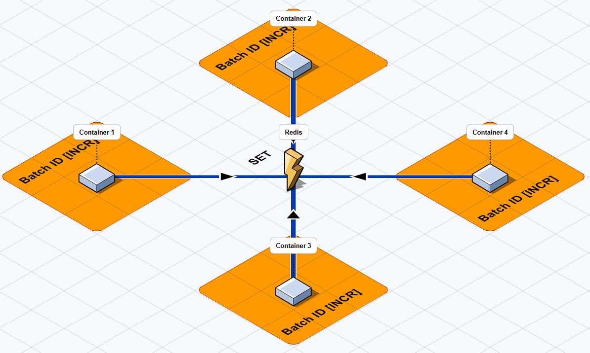

### 1. user-service

```
1. Kết nối với mongodb
2. Thêm dữ liệu vào users db
```

> Bài toán đặt ra: Khi đẩy hàng nghìn / triệu User vào db 1 lúc xử lý như nào với 1 db khi hệ thống cấu hình 1 container user-service

> Giải quyết: 
> 1. Tăng số lượng container thông qua replica. Sử dụng **distribute lock** của redis để khóa không để bị dulicate key khi nhiều container cùng thêm 1 user giống nhau.

> 2. Vậy thì khi chia như vậy thì khi bị lock thì chỉ có 1 container làm việc còn mấy container khác ngồi chơi => tốn bộ nhớ => cần có cơ chế song song cho các container

> 3. Khi chạy song song thì redis có cơ chế **atomic counter** <nghĩa là tăng giá trị key lên 1 đơn vị 1 cách toàn vẹn> ta có thể chia ra thành các batch cho các container mà không cần lock thủ công để đảm bảo không bị trùng lặp và thỏa mãn chạy song song.

> 4. Ta kết hợp scale các container phù hợp và sử dụng các cơ chế của redis **distribute lock** init và **atomic counter** và **redis TTL** phân tán các task để tối ưu tốc độ lưu trữ dữ liệu vào db và cải thiện CPU.



[FILE JSON](../../../structure/diagram-2025-11-05.json)

```
CMD: 
    - k : runing parallel
    1. docker-compose up -d --build --scale user-service=k
    2. $ for i in {1..k}; do
        docker exec source-user-service-$i node seed-data.js &
    done
    wait
    echo "All seed processes completed"
    [run upload data into mongodb with k service div <all users> / <user_batch> batchs]
```