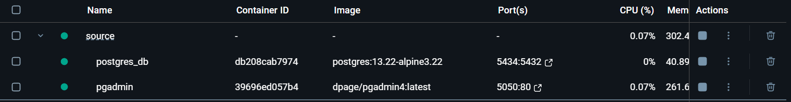
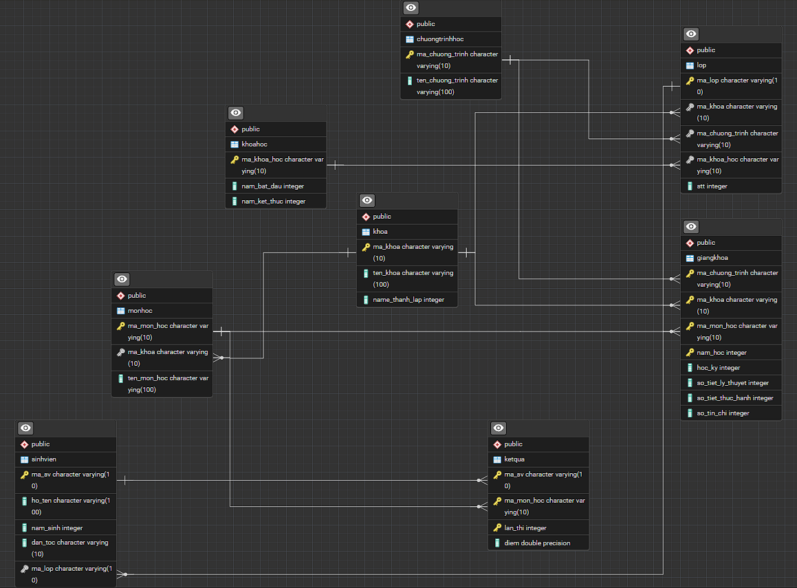

# TYP Training 2025

## Vương Đức Trọng

### Week 1

#### [I. Create backend project](\source)

```
- Dependencies:
    1. lombok
    2. spring-boot-web-test
    3. jdbc
    4. jpa
    5. postgres

- Techs:
    1. PotgreSQL
    2. Pgadmin

- Tools: 
    1. Docker-desktop:
    2. Intellij
    3. Vscode

- Guide:
    1. git clone my-repo
    2. cd source
    3. docker-compose up -d : to turn on containers
    4. into docker-desktop click link: 5050:80 to see UI db 
    5. Pgadmin UI => Enter username : admin@admin.com
                           Password : admin
    6. Enter name server : Postgres Server (custom)
       Host name : postgres_db
       port : 5432
       name db : management
       username : postgres
       password : postgres
    7. docker-compose down : to turn off containers
```


#### II. Create database: management (QuanLySinhVien)
[1. Intital Tables](Database/intitial_database.sql)
```
- Tables:
    1. Khoa
    2. KhoaHoc
    3. ChuongTrinhHoc
    4. Lop
    5. SinhVien
    6. MonHoc
    7. KetQua
    8. GiangKhoa
```
[2. ERD For Database](source/images/ERD.png)



[3. Insert Data](Database/insert_data.sql)

[4. Query Data](Database/query_data.sql)